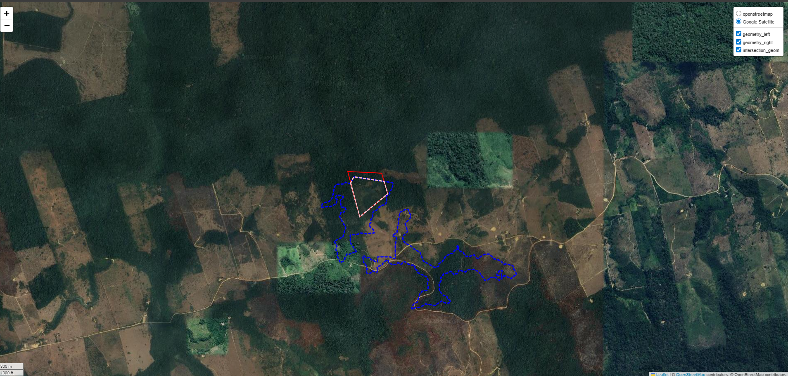
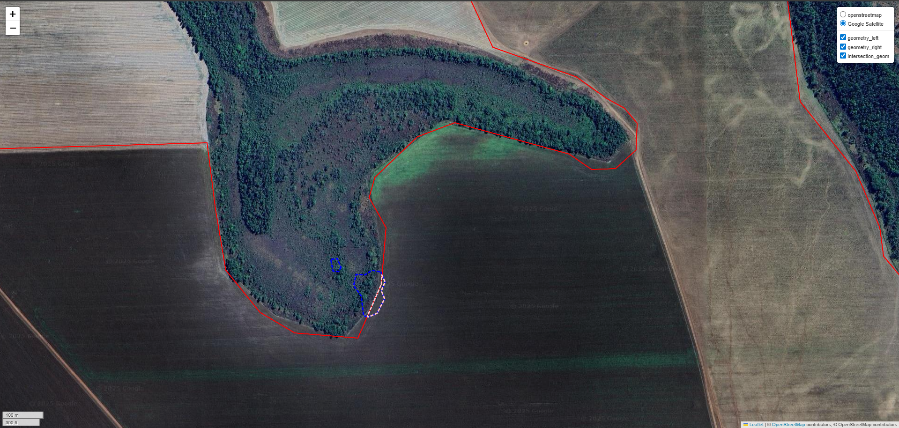

# spatial-intersection-checks
Utility functions to identify true polygon intersections in GIS workflows. 
 
The algorithm works by:

1. Applying spatial predicates to identify candidate intersecting geometries
2. Using configurable buffer operations (morphological opening) to validate whether intersections represent
meaningful area overlap rather than boundary or vertex contact
3. Returning only polygons that satisfy the criteria for true spatial intersection
---
### Motivation

Relating geometries is a fundamental task in spatial data analysis and GIS workflows.
This is commonly done using spatial predicates (e.g. `intersects`, `touches`, `overlaps`).
However, relying exclusively on these operations can lead to false positives.

In practice, many detected intersections occur when polygon boundaries merely touch
along edges or at single vertices. These cases do not represent true spatial overlap,
but are often the result of georeferencing inaccuracies or topological artifacts
introduced during polygon creation.

To address this issue, **spatial-intersection-checks** provides a lightweight algorithm
to identify *true* polygon intersections by combining spatial predicates with
buffer-based validation and additional geometric checks.

---
### Packages used:
- Geopandas
- pathlib
- numpy
- logging
- folium
---
### The Process:
This section describes the reasoning and iterative process that led to the final design of the algorithm.

The first (unpublished) versions of the algorithm relied exclusively on standard spatial predicates (such as intersects, touches, and overlaps) to identify relationships between pairs of polygons. While these predicates are useful for candidate detection, they frequently produced false positives, especially in cases where geometries only touched at boundaries or shared very thin overlaps.

To address these limitations, I explored concepts from mathematical morphology applied to spatial geometries. In particular, the algorithm incorporates a morphological opening operation (erosion followed by dilation) applied to the intersection geometry. This operation removes narrow, spurious, or structurally insignificant intersections that do not represent meaningful spatial overlap.

After computing the exact intersection geometry between polygons, the algorithm applies a distance parameter d to perform the morphological opening. An intersection is then considered a candidate for a true spatial intersection only if the opened geometry is non-empty and the intersection area exceeds a minimum threshold. This combination allows the algorithm to distinguish real overlaps from boundary contacts and thin artifacts in a robust and geometrically meaningful way.

To further increase robustness, the algorithm performs a series of validation checks on the input data prior to the opening process. These checks ensure that the spatial analysis is feasible and consistent, including validation of coordinate reference systems and spatial units.

Finally, the module also includes a lightweight spatial exploration function. In GIS workflows, visual inspection remains a critical step for validating spatial logic and analytical decisions, and this function allows users to visually explore individual intersection cases directly within an interactive map.

---
### What I Learned
`Mathematical Morphology`

During the development of this algorithm, I explored in depth the concepts of morphological erosion and dilation. Although these techniques are widely used in image processing, this project reinforced how powerful they can also be when applied to vector-based geoprocessing problems. In particular, morphological opening proved to be an effective strategy to filter out thin or spurious spatial intersections.

`Logging and Debugging`

While designing the algorithm, I consistently considered how a final user would interact with it. This perspective was essential not only for ensuring robust spatial logic, but also for improving user experience. As a result, I explored the Python logging module in depth and adopted structured INFO and WARNING messages instead of relying solely on print statements. This approach provides clearer feedback and makes the workflow easier to debug and maintain.

`Interactive Spatial Validation with Folium`

In many GIS workflows, analysts perform most of the analysis in Python and then export the results to desktop GIS software (such as QGIS or ArcGIS) for visual inspection. To provide a faster and more lightweight alternative, I incorporated an interactive exploration function using folium. While this tool does not replace full-featured GIS software, it serves as an efficient sanity check, allowing users to visually validate spatial intersections directly within a Python environment.

`API Design and Internal Interfaces`

During the development of this project, I gained a deeper understanding of internal API design.

---
### How can it be improved:
- Extend the algorithm to support additional vector geometries (e.g. `LineString` and `Point`), adapting the validation logic to different dimensional intersections.
- Provide optional support for parallel processing to improve performance when working with large spatial datasets.
  
---
### Run the project:
Simple clone this repo into your local machine and start exploring. The main function is spatial_intersection_checks.py

---
### Examples
Valid intersection 
The example below shows a case where the intersection between polygons
is considered valid after the morphological opening and area checks (distance 10m and minimal area of 10_000).

Invalid intersection 
The example below shows a false-positive case, where polygons intersect
only through boundary contact or a very thin overlap. After applying the
morphological opening, this intersection is correctly discarded (distance 10m and minimal area of 10_000).

